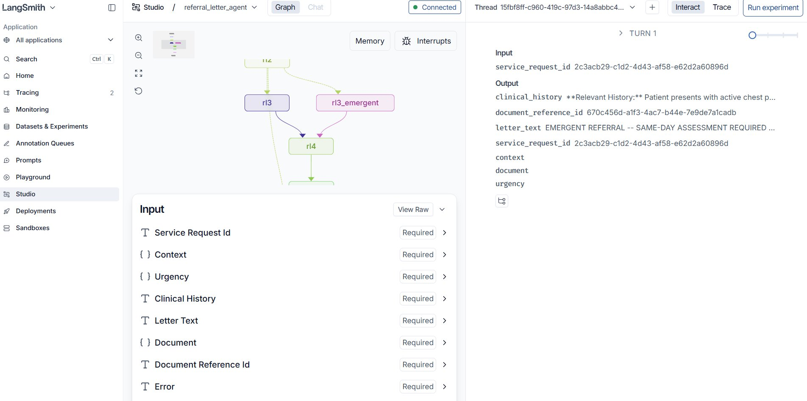
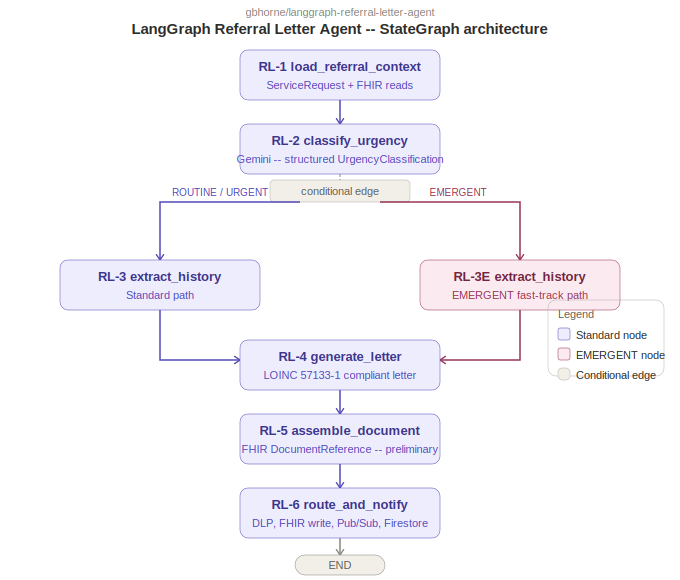

# LangGraph Referral Letter Agent

LOINC 57133-1 compliant specialist referral letters with urgency classification (ROUTINE / URGENT / EMERGENT) -- LangGraph StateGraph + Gemini 2.5 Flash on GCP.

Companion repo to [gbhorne/adk-referral-letter-agent](https://github.com/gbhorne/adk-referral-letter-agent). Same pipeline, different orchestration framework.

---

## Disclaimer

This project uses entirely synthetic, fictitious FHIR data generated for demonstration purposes only. No real patient data, protected health information, or actual clinical records are used at any stage. All patient names, clinical values, diagnoses, and medications are for demonstration purposes only. This project is not intended for clinical use.

---

## LangGraph Studio -- live graph execution



The conditional edge at RL-2 is visible as two explicit branches -- `rl3` (ROUTINE/URGENT path) and `rl3_emergent` (EMERGENT path) -- both converging at `rl4`. The state panel on the right shows all typed state fields populated after execution. This routing is deterministic and unit-testable without any LLM calls.

---

## Framework Comparison: LangGraph vs ADK

| | LangGraph | Google ADK |
|--|-----------|------------|
| Urgency routing | Conditional edge at RL-2 node -- declared in graph definition, deterministic | Gemini produces classification; RL-6 routes based on output at runtime |
| Testability | Unit-testable: set urgency in state, assert edge taken, no LLM call needed | Full pipeline invocation required to test routing |
| Tracing | LangSmith traces state transitions and token usage per node | ADK Web UI shows tool invocations and outputs in real time |
| Orchestration | StateGraph with typed state schema; deterministic node ordering | Single `run_referral_pipeline` FunctionTool; ADK agent drives execution |
| Graph visibility | LangGraph Studio shows conditional edge branches live | ADK Web UI shows linear tool call sequence |

**ADK repo:** [gbhorne/adk-referral-letter-agent](https://github.com/gbhorne/adk-referral-letter-agent)

---

## Agent Pipeline

| Step | Node | Description |
|------|------|-------------|
| RL-1 | `node_rl1` | Reads ServiceRequest and linked Encounter, Condition, Observation, MedicationRequest from FHIR |
| RL-2 | `node_rl2` | Gemini classifies urgency -- output drives conditional edge |
| RL-3 | `node_rl3` | Extracts clinical history scoped to referral reason (ROUTINE / URGENT path) |
| RL-3E | `node_rl3_emergent` | Same extraction on EMERGENT fast-track path |
| RL-4 | `node_rl4` | Gemini generates LOINC 57133-1 referral letter |
| RL-5 | `node_rl5` | Assembles FHIR DocumentReference with docStatus preliminary |
| RL-6 | `node_rl6` | DLP inspect, FHIR write, Pub/Sub routing, Firestore audit, EMERGENT Communication resource |

---

## Architecture



## GCP Infrastructure

Shares all infrastructure with the ADK companion repo -- same FHIR store, same Pub/Sub topics, same Firestore database, same service account.

| Service | Role |
|---------|------|
| Cloud Healthcare API (FHIR R4) | Source of ServiceRequest and clinical resources; target for DocumentReference write-back |
| Vertex AI (Gemini 2.5 Flash) | Urgency classification, clinical history extraction, letter generation |
| Cloud Pub/Sub | Outbound topics split by urgency (`referral-routine`, `referral-urgent`, `referral-emergent`) |
| Firestore | Urgency classification audit log |
| Sensitive Data Protection | PHI inspection of generated letter text before write-back |

---

## Repository Structure

```
agents/
  graph.py                        # LangGraph StateGraph definition and conditional edge
  rl1_load_referral_context.py    # FHIR data ingestion
  rl2_classify_urgency.py         # Gemini urgency classification
  rl3_extract_clinical_history.py # Scoped history extraction (standard path)
  rl4_generate_referral_letter.py # LOINC 57133-1 letter generation
  rl5_assemble_document.py        # FHIR DocumentReference assembly
  rl6_route_and_notify.py         # DLP, FHIR write, Pub/Sub routing, Firestore audit
shared/
  config.py                       # Environment config
  models.py                       # Pydantic models: UrgencyLevel, UrgencyClassification, ReferralContext
  fhir_client.py                  # Cloud Healthcare API wrapper
  dlp_client.py                   # Sensitive Data Protection wrapper
scripts/
  load_synthetic_patient.py       # Loads synthetic FHIR resources for testing
main.py                           # Entry point -- invokes the graph with a ServiceRequest ID
langgraph.json                    # LangGraph Studio config
docs/
  langgraph_studio.png            # LangGraph Studio screenshot
```

---

## Setup

### Prerequisites

- Python 3.11+
- GCP infrastructure from the ADK companion repo already provisioned
- LangSmith account and API key (smith.langchain.com)

### Local setup

```bash
git clone https://github.com/gbhorne/langgraph-referral-letter-agent.git
cd langgraph-referral-letter-agent

python -m venv venv
venv\Scripts\activate

pip install -r requirements.txt

cp .env.example .env
# Add your LANGCHAIN_API_KEY to .env
```

### Environment variables

```
GCP_PROJECT=your-project-id
LOCATION=us-central1
FHIR_STORE_URL=https://healthcare.googleapis.com/v1/projects/YOUR_PROJECT/locations/us-central1/datasets/healthcare-dataset/fhirStores/referral-letter-store/fhir
PUBSUB_INBOUND=referral-requested
PUBSUB_ROUTINE=referral-routine
PUBSUB_URGENT=referral-urgent
PUBSUB_EMERGENT=referral-emergent
FIRESTORE_COLLECTION=referral-audit
LANGSMITH_TRACING=true
LANGSMITH_PROJECT=langgraph-referral-letter-agent
LANGCHAIN_API_KEY=your-langsmith-api-key
```

---

## Human Review Gate

All DocumentReference resources are written with `docStatus: preliminary`. The referring clinician must promote the document to `final` before it is visible to downstream consumers or released to the patient portal. The agent does not finalize clinical documentation autonomously.

---

*Built by [Gregory Horne](https://github.com/gbhorne) -- Healthcare AI and GCP agentic systems portfolio.*
